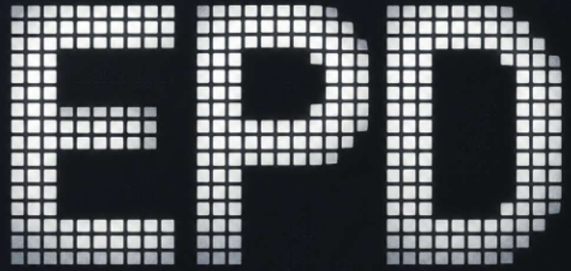

<p align="center">
  
</p>

<h1 align="center">EPD Studio</h1>

<p align="center">墨水屏本地自定义看板与图片上传工具</p>

<p align="center">
  
  
  
</p>

<p align="center">
  <b>手动连接蓝牙 · 生成三色看板 · 上传到墨水屏</b>
</p>

## ✨ 功能状态

| 功能 | 状态 | 说明 |
|---|:---:|---|
| Original 图片上传 | ✅ | 选择、预览并上传本地图片 |
| Custom 看板生成 | ✅ | 按当前日期生成 400 × 300 黑白红看板 |
| 电池电量读取 | ✅ | 连接设备后显示当前电量 |
| Codex 额度读取 | ✅ | 显示 5h 与 7d 额度，需要本机 Codex 登录 |
| 30 分钟自动刷新 | 🚧 | 暂未启用，设备连接会自动断开，需要手动重连 |
| 更高清内容显示 | 🚧 | 当前仍受墨水屏原生点阵分辨率限制 |

## 🚀 快速开始

本项目基于 [EPD-nRF5](https://github.com/tsl0922/EPD-nRF5) 开发，感谢大佬开源。><

下载项目后，在仓库根目录运行：

```powershell
python app\launch.py
```

启动脚本会打开本地网页。在 Edge 的蓝牙选择器中选择 `NRF-EPD-XXXX`，连接成功后即可使用。详细操作与故障处理见 [使用说明](USAGE.md)。

## 🧭 使用流程

| 步骤 | 操作 |
|:---:|---|
| 01 | 运行启动脚本，等待 Edge 本地网页打开 |
| 02 | 点击“连接”，选择 `NRF-EPD-XXXX` 完成蓝牙配对 |
| 03 | 在 `01 Original` 或 `02 Custom` 中准备预览内容 |
| 04 | 点击上传按钮，等待传输完成后检查实体屏幕 |

## ⚠️ 注意事项

1、目前只支持 Windows。

2、Codex 额度读取需要安装并登录 Codex；未登录时额度显示为 `--`。

3、设备初次连接成功后，若显示断开，点击“重连”即可。重启网页后需要重新连接蓝牙（蓝牙搜索较慢，耐心等待即可）

4、不要在图片传输过程中关闭页面、停止服务或重复点击上传。网页提示传输完成只代表命令发送结束，仍需确认实体屏幕显示结果。

## 📚 来源与许可

本项目按 [GPL-3.0](LICENSE) 发布。蓝牙协议、图片传输和设备交互实现参考 [EPD-nRF5](https://github.com/tsl0922/EPD-nRF5)；第三方来源说明见 [THIRD_PARTY.md](THIRD_PARTY.md)。
